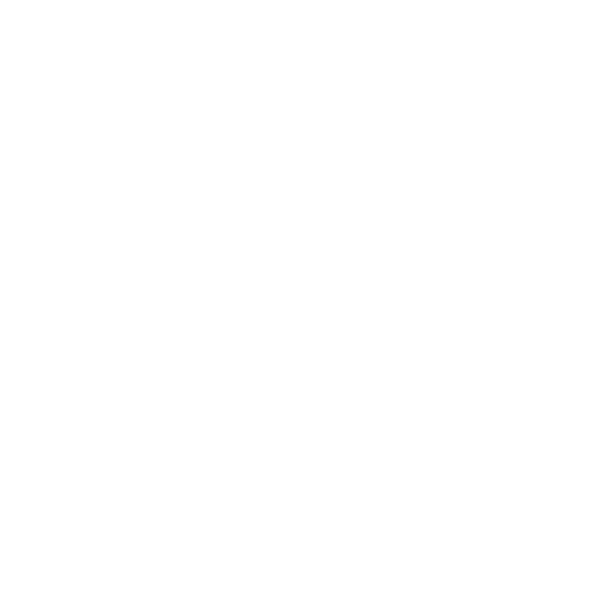

# Divine QR ⚡️

A QR art generator using IA and open-source LLM's from [huggingface](https://huggingface.co/)!




🚨 Disclaimer 🚨

This project was discontinuated due to some incompatibilities with the techonologies chosen for the project.The project is deployed using Deno, but the hugginface client is not compatible. As the project was merely academical, it wasn't worth the effort persuing the solution (ex: switching from Deno to Node and deploying to Vercel instead of Deno Deploy)

You can still run this project locally without any problems!

## Quick start

1. Initalize the project

```
git clone https://github.com/randreu28/divine-qr
yarn install
```

2. Create an `.env.local` file with your personal hugginface API key, like so:

```
VITE_HF_TOKEN="..."
```

3. Start the development enviroment and enjoy!

```
yarn dev
```

## Project Structure

This project is using Qwik with [QwikCity](https://qwik.builder.io/qwikcity/overview/). QwikCity is just an extra set of tools on top of Qwik to make it easier to build a full site, including directory-based routing, layouts, and more.

Inside your project, you'll see the following directory structure:

```
├── public/
│   └── ...
└── src/
    ├── components/
    │   └── ...
    └── routes/
        └── ...
```

- `src/routes`: Provides the directory-based routing, which can include a hierarchy of `layout.tsx` layout files, and an `index.tsx` file as the page. Additionally, `index.ts` files are endpoints. Please see the [routing docs](https://qwik.builder.io/qwikcity/routing/overview/) for more info.

- `src/components`: Recommended directory for components.

- `public`: Any static assets, like images, can be placed in the public directory. Please see the [Vite public directory](https://vitejs.dev/guide/assets.html#the-public-directory) for more info.

## Add Integrations and deployment

Use the `yarn qwik add` command to add additional integrations. Some examples of integrations includes: Cloudflare, Netlify or Express Server, and the [Static Site Generator (SSG)](https://qwik.builder.io/qwikcity/guides/static-site-generation/).

```shell
yarn qwik add # or `yarn qwik add`
```

## Development

Development mode uses [Vite's development server](https://vitejs.dev/). The `dev` command will server-side render (SSR) the output during development.

```shell
npm start # or `yarn start`
```

> Note: during dev mode, Vite may request a significant number of `.js` files. This does not represent a Qwik production build.

## Preview

The preview command will create a production build of the client modules, a production build of `src/entry.preview.tsx`, and run a local server. The preview server is only for convenience to preview a production build locally and should not be used as a production server.

```shell
yarn preview # or `yarn preview`
```

## Production

The production build will generate client and server modules by running both client and server build commands. The build command will use Typescript to run a type check on the source code.

```shell
yarn build # or `yarn build`
```

## Deno Server

This app has a minimal [Deno server](https://deno.com/manual/examples/http_server) implementation. After running a full build, you can preview the build using the command:

```
npm run serve
```

Then visit [http://localhost:8080/](http://localhost:8080/)
